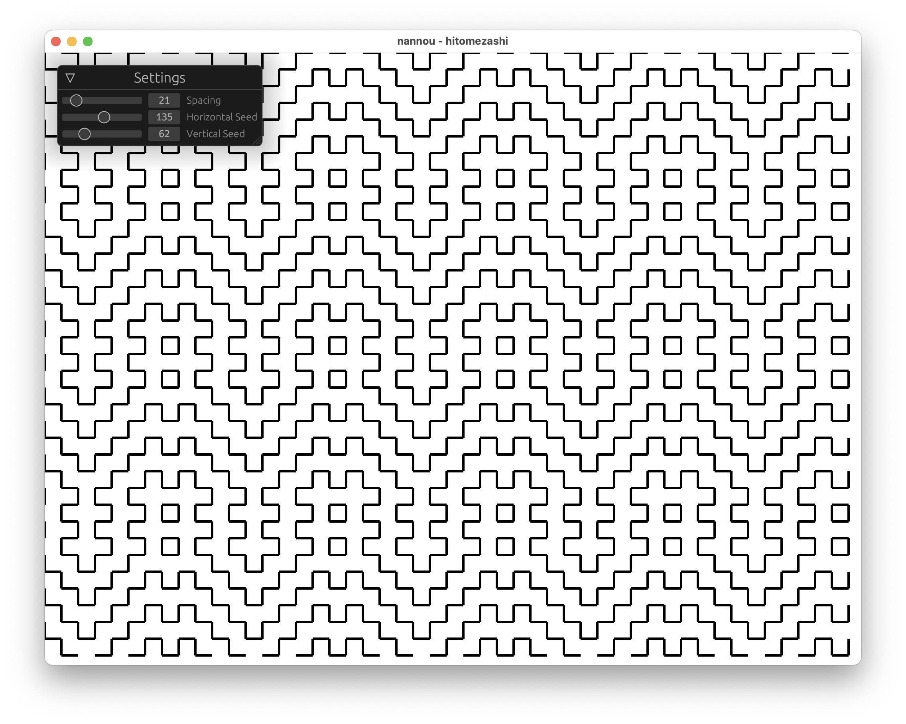

# Hitomezashi Patterns

I created this repo to play around with creating different [Hitomezashi patterns](https://www.youtube.com/watch?v=JbfhzlMk2eY) using the [nannou](https://github.com/nannou-org/nannou) library for creating visualizations.

To run it, clone the repo, and run `cargo run --release` at the command line.

## Future Goals
- ~~Allow user to input seed at runtime~~
- Draw more than square grids
    - Triangular
    - Hexagonal
- Ideally end up with something like [this site](https://hitomezashi.com)
